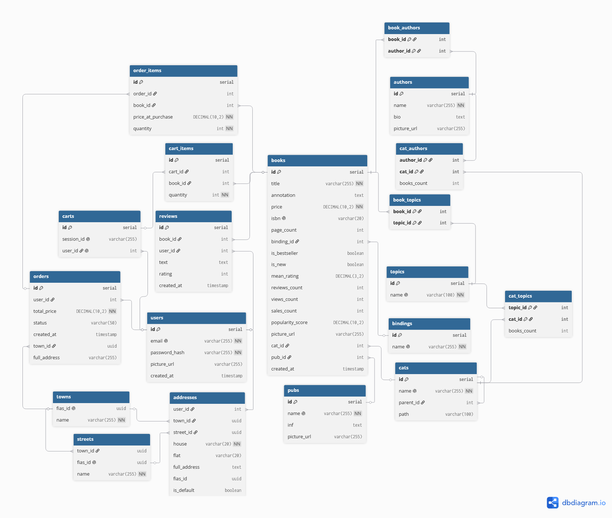
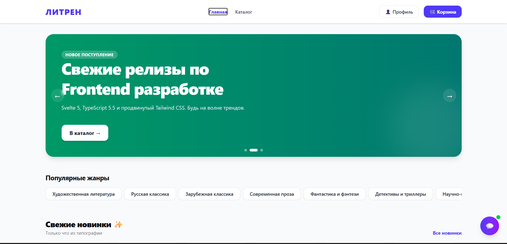
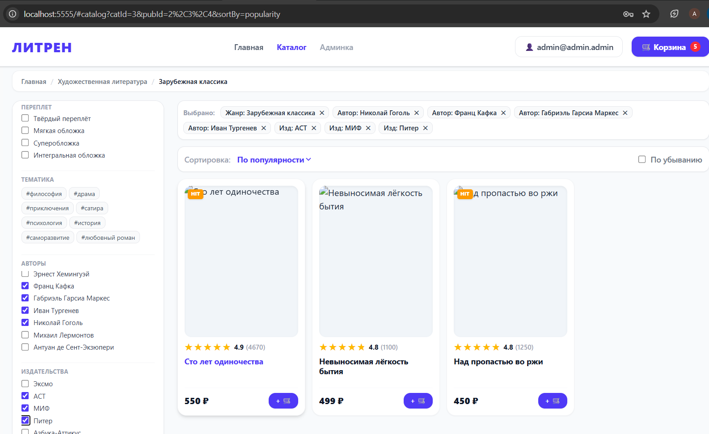
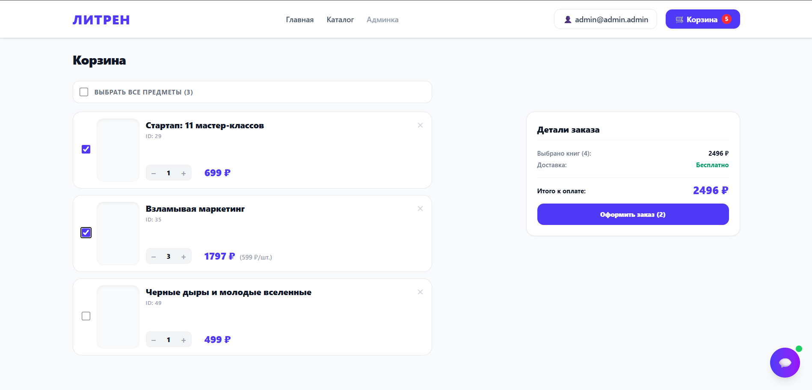
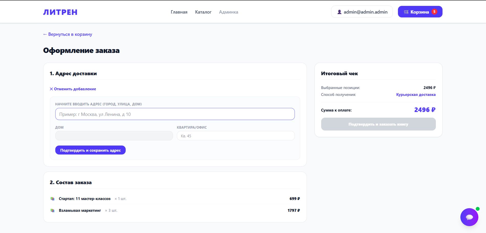
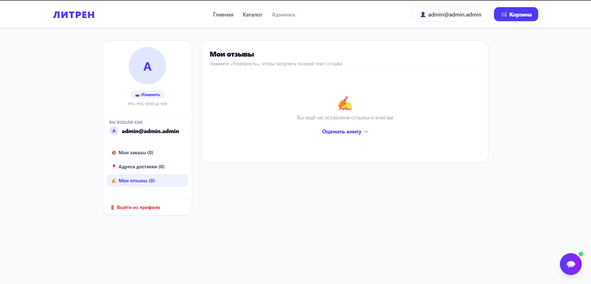
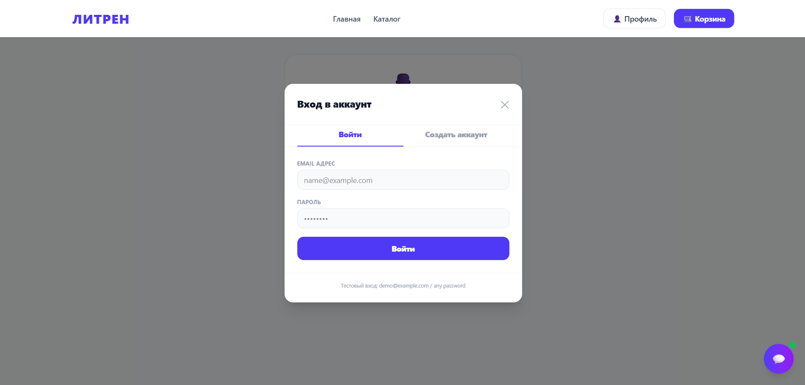
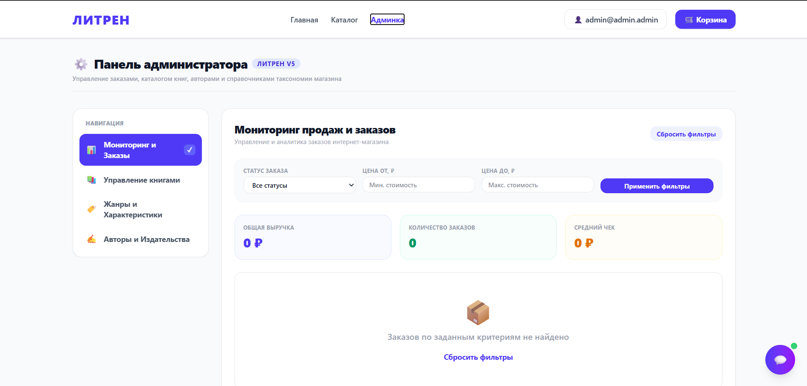

# 📚 ЛиТрен — интернет-магазин книг

Современный книжный магазин на FastAPI + Svelte 5.

## База данных
### Схема бд


### Стек
- PostgreSQL (для параллелизма и асинхронности)


### Ключевые особенности
- детально продуманная бд с учётом механики реального интернет-магазина
- большая часть логики работы с бд вынесена в триггеры
- в некоторых местах выполнена намеренная денормализация бд
- для хранения адресов используется современный подход с FIASS

## Бэкенд
### Стек
- fastapi (самая лучшая вещь для веба из мира python)
- asyncpg (самый быстрый асинхронный драйвер бд из мира python)
- uvicorn (оказывается, вся скорость fastapi сосредоточена в этом сервере, написанном на Cython)
- uv (чудесный быстрый пакетный менеджер, написанный на rust)

### Ключевые особенности
- #### !Намеренный отказ от ORM для понимания SQL и прозрачности
- Полная авторизация через HttpOnly куки и JWT
- Соблюдение лучших практик разработки (слоистая архитектура, инкапсуляция настроек, Dependency Injection)

## Фронтенд
### Стек
- Svelte 5 (быстро, лаконично, нишево)
- tailwindcss (чтобы не бояться css)
- TypeScript (для типизации и более надёжного соединения с pydantic-схемами api)
- Vite (стандартный быстрый сборщик)

### Ключевые особенности
- SPA с URL-маршрутизацией (можно открыть каталог с конкретными фильтрами по ссылке; параметры url пробрасываются между страницами сайта)
- Интеграция с сервисом DADATA (логика хранения адресов в бд также настроена под него)
- Отсутствие управления куками и токенами на фронтенде (все реализуется на бекенде)
- Соблюдение лучших практик UI и UX: (общее состояние для товаров на всех страницах, Skeleton-шаблоны при долгой загрузке, адаптивная вёрстка, стабильность url, ...)

## DevOps
### Стек
- docker
- docker compose
- nginx

### Ключевые особенности
- Все сервисы упакованы в отдельные контейнеры и соединены общей сетью, так что общение между сервисами происходит внутри docker-сети
- Порт БД закрыт наружу, так же можно сделать и с api
- nginx используется как базовый фронт-сервер


#### Главная

#### Каталог

#### Корзина

#### Заказ

#### Профиль

#### Авторизация

#### Админка



## Запуск
```bash
# 0. Не буду учить, как скачивать docker compose и git

# 1. Клонировать репозиторий
git clone https://github.com/yourusername/LiTren.git
cd LiTren

# 2. Создать .env файл
cp .env.example .env
# Отредактировать .env (указать пароли, токены)

# 3. Запустить
docker compose up -d --build

# 4. Открыть в браузере
# Фронтенд: http://localhost:<выбранный порт>
# API Docs: http://localhost:<выбранный порт>/docs


